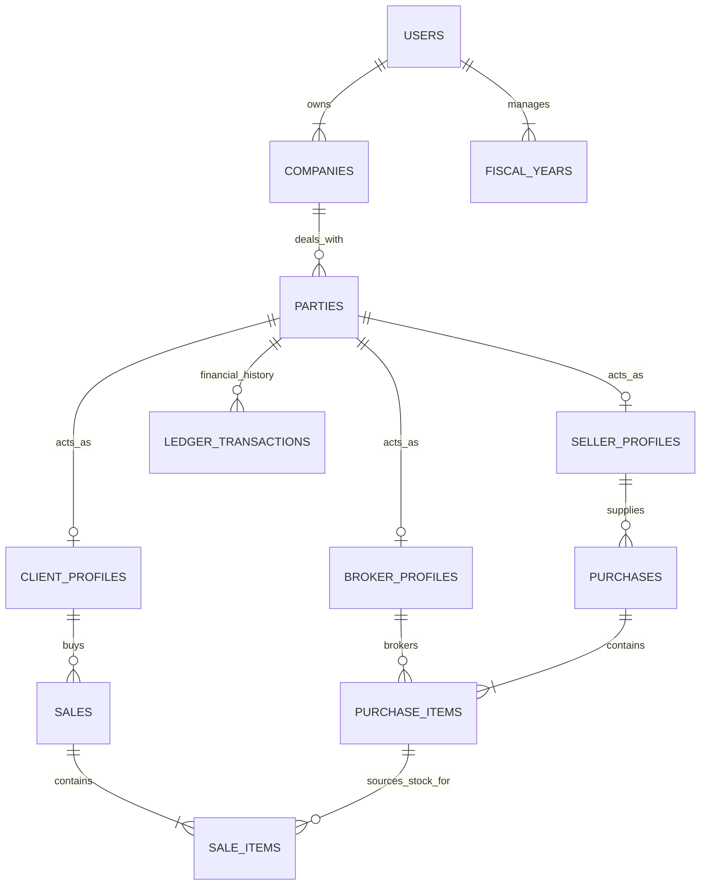

# Proposed PostgreSQL Schema Design (Party Pattern)

> **Architectural Decision**: This schema uses the **"Party Model"** (Universal Parties).
> By treating everyone as a "Party", we solve three major problems:
>
> 1.  **Duplicate Data**: A farmer who is also a buyer doesn't need two records.
> 2.  **Complex Payments**: We don't need separate payment tables or complex logic. A unified ledger handles everything.
> 3.  **Scalability**: Adding new roles (e.g., "Transporter") later is easy; just add a new profile table.

---

## 1. High-Level ER Diagram



---

## 2. Table Definitions

### A. Authentication & Tenancy

#### `users`

System users (Traders/Admins) who login to the app.
| Column | Type | Constraints | Description |
| :--- | :--- | :--- | :--- |
| `id` | UUID | PK | Unique User ID |
| `email` | VARCHAR(255) | UNIQUE | Login Email |
| `password_hash` | VARCHAR | NOT NULL | |
| `role` | VARCHAR(20) | | Admin/User |

#### `companies`

Business entity (Tenant) details.
| Column | Type | Constraints | Description |
| :--- | :--- | :--- | :--- |
| `id` | UUID | PK | |
| `user_id` | UUID | FK `users.id` | Owner |
| `legal_name` | VARCHAR(255) | | |

---

### B. The Party Model (Unified Contacts)

#### `parties`

**The Master Table**. Represents any real-world entity the business deals with (Client, Seller, Transporter, Agent).
| Column | Type | Constraints | Description |
| :--- | :--- | :--- | :--- |
| `id` | UUID | PK, Def `uuid_generate_v4()` | Unique Party ID |
| `company_id` | UUID | FK `companies.id` | Belongs to which Tenant? |
| `display_name` | VARCHAR(100) | NOT NULL | Common Name (e.g. "Ramesh Farmer") |
| `phone_primary` | VARCHAR(20) | NOT NULL | Primary Contact |
| `phone_secondary`| VARCHAR(20) | | |
| `address` | TEXT | | |
| `city` | VARCHAR(100) | | |
| `gst_number` | VARCHAR(20) | | Tax ID |
| `pan_number` | VARCHAR(20) | | ID Proof |
| `tags` | TEXT[] | | e.g. ['VIP', 'BadPaymaster'] |
| `is_active` | BOOLEAN | Default `true` | Soft delete |
| `created_at` | TIMESTAMPTZ | Default `NOW()` | |

#### `seller_profiles`

Extension table. Exists ONLY if the party acts as a Seller.
| Column | Type | Constraints | Description |
| :--- | :--- | :--- | :--- |
| `party_id` | UUID | PK, FK `parties.id` | 1-to-1 linkage |
| `default_broker_id`| UUID | FK `parties.id` | Preferred broker? |
| `internal_rating` | INT | | 1-5 Stars |

#### `client_profiles`

Extension table. Exists ONLY if the party acts as a Buyer.
| Column | Type | Constraints | Description |
| :--- | :--- | :--- | :--- |
| `party_id` | UUID | PK, FK `parties.id` | 1-to-1 linkage |
| `credit_limit` | DECIMAL(12,2) | | Max allowed debt |
| `payment_terms` | VARCHAR(50) | | e.g. "Net 30 Days" |

#### `broker_profiles`

Extension table. Exists ONLY if the party acts as a Broker.
| Column | Type | Constraints | Description |
| :--- | :--- | :--- | :--- |
| `party_id` | UUID | PK, FK `parties.id` | 1-to-1 linkage |
| `commission_type` | VARCHAR | CHECK ('Fixed', '%') | |
| `per_unit_rate` | DECIMAL | | Commission Rule |

---

### C. Financial Ledger (The "General Ledger")

#### `ledger_transactions`

Replaces all separate "Payment" and "Credits" tables.
| Column | Type | Constraints | Description |
| :--- | :--- | :--- | :--- |
| `id` | UUID | PK | |
| `party_id` | UUID | FK `parties.id` | **Unified Foreign Key** |
| `company_id` | UUID | FK `companies.id` | Tenant Context |
| `transaction_date` | TIMESTAMPTZ | Default `NOW()` | Valued Date |
| `amount` | DECIMAL(15,2) | NOT NULL | `>0` (Credit/Payment In), `<0` (Debit/Payment Out) |
| `type` | VARCHAR(50) | | 'Payment_Received', 'Payment_Made', 'Invoice_Debit', 'Bill_Credit' |
| `payment_mode` | VARCHAR(20) | | 'Cash', 'Cheque', 'UPI', 'Adjust' |
| `reference_id` | UUID | | Link to `sales.id` or `purchases.id` |
| `reference_type` | VARCHAR | | 'Sales', 'Purchases' |
| `description` | TEXT | | Notes |

_To get the balance for ANY party:_

```sql
SELECT SUM(amount) FROM ledger_transactions WHERE party_id = '...'
```

_(Positive sum means we owe them; Negative sum means they owe us - or vice versa depending on your accounting sign convention)_

---

### D. Inventory & Operations

#### `purchases` (Inward Stock)

| Column            | Type        | Constraints     | Description      |
| :---------------- | :---------- | :-------------- | :--------------- |
| `id`              | UUID        | PK              |                  |
| `seller_party_id` | UUID        | FK `parties.id` | Link to Supplier |
| `purchase_date`   | DATE        | Default `NOW()` |                  |
| `invoice_no`      | VARCHAR(50) |                 | Vendor's Bill No |

#### `inventory_batches` (The Stock Unit)

| Column            | Type          | Constraints               | Description       |
| :---------------- | :------------ | :------------------------ | :---------------- |
| `id`              | UUID          | PK                        |                   |
| `purchase_id`     | UUID          | FK `purchases.id`         |                   |
| `broker_party_id` | UUID          | FK `parties.id`           | Broker involved   |
| `item_name`       | VARCHAR(100)  |                           | Product           |
| `package_type`    | VARCHAR(50)   |                           | Sack/Box          |
| `initial_qty`     | DECIMAL(10,3) |                           |                   |
| `current_qty`     | DECIMAL(10,3) |                           | Decreases as sold |
| `buy_rate`        | DECIMAL(10,2) |                           | Cost              |
| `status`          | VARCHAR(20)   | CHECK ('InStock', 'Sold') |                   |

#### `sales` (Outward Stock)

| Column            | Type        | Constraints     | Description       |
| :---------------- | :---------- | :-------------- | :---------------- |
| `id`              | UUID        | PK              |                   |
| `client_party_id` | UUID        | FK `parties.id` | Link to Buyer     |
| `sale_date`       | DATE        |                 |                   |
| `invoice_no`      | VARCHAR(50) | UNIQUE          | Generated Bill No |

#### `sale_items`

| Column               | Type          | Constraints               | Description           |
| :------------------- | :------------ | :------------------------ | :-------------------- |
| `id`                 | UUID          | PK                        |                       |
| `sale_id`            | UUID          | FK `sales.id`             |                       |
| `inventory_batch_id` | UUID          | FK `inventory_batches.id` | **Traceability Link** |
| `qty_sold`           | DECIMAL(10,3) |                           |                       |
| `sell_rate`          | DECIMAL(10,2) |                           |                       |
| `amount`             | DECIMAL(15,2) |                           |                       |

---

## 3. Benefits of this Design

1.  **Cleaner Code**: You don't need `if (type === 'Seller') searchSeller() else searchClient()`. You just `searchParties()`.
2.  **Unified Analytics**: "Who are my top 10 parties by volume?" (regardless of whether they are buying or selling) becomes a simple query.
3.  **Future Proof**: If you start dealing with "Transporters" who strictly take payment for logistics, you just add `transporter_profiles`. The `parties` and `ledger_transactions` tables don't change at all.
